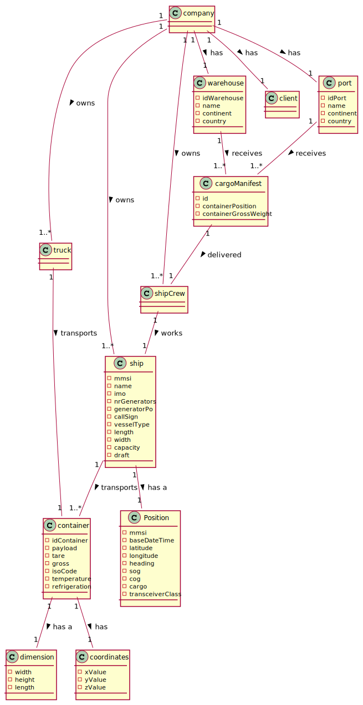

# OO Analysis #

The construction process of the domain app.domain.model is based on the client specifications, especially the nouns (for _
concepts_) and verbs (for _relations_) used.

## Rationale to identify domain conceptual classes ##

To identify domain conceptual classes, start by making a list of candidate conceptual classes inspired by the list of
categories suggested in the book "Applying UML and Patterns: An Introduction to Object-Oriented Analysis and Design and
Iterative Development".

### _Conceptual Class Category List_ ###

**Business Transactions**
---

**Transaction Line Items**

* Containers

---

**Product/Service related to a Transaction or Transaction Line Item**

* Loading Cargo Manifest

---

**Transaction Records**

* Cargo Manifest

--- 

**Roles of People or Organizations**

* Client
* Fleet manager
* Traffic manager
* Warehouse staff
* Warehouse manager
* Port staff
* Port manager
* Ship captain
* Ship chief electrical engineer 
* Truck driver

---

**Places**

* Ports
* Warehouses
* Application

---

**Noteworthy Events**

* Loads and unloads

---

**Physical Objects**

* Containers

---

**Descriptions of Things**

* 

---

**Catalogs**

*

---

**Containers**

* Company

---

**Elements of Containers**

* Ship
* Containers

---

**Organizations**

* US Coast Guard

---

**Other External/Collaborating Systems**

* 

---

**Records of finance, work, contracts, legal matters**

* Cargo Manifest

---

**Financial Instruments**

*

---

**Documents mentioned/used to perform some work**

* Cargo Manifest

---

### **Rationale to identify associations between conceptual classes**

| Concept (A)        |  Association    |  Concept (B) |
|----------	   		|:-------------:    |------:       |
| Company                           | owns               | Truck |
| Company                           | owns               | Ship |
| Company                           | employs            | Ship Crew |
| Company                           | owns               | Port |
| Company                           | owns               | Warehouses |
| Company                           | has                | Client |
| Ship                              | transports         | Container |
| Ship                              | has a              | Location  |
| Container                         | has                | Coordinates |
| Container                         | has                | Dimension |
| Truck                             | transports         | Container |
| Warehouse                         | has                | Location |
| Warehouse                         | receives           | Cargo Manifest |
| Port                              | has                | Location |
| Port                              | receives           | Cargo Manifest |
| Ship Crew                         | works              | Ship |
| Cargo Manifest                    | delivered to       | Ship Crew |

## Domain Model

