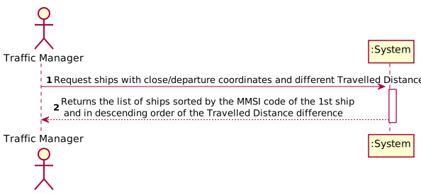

# US 011 - To create a new parameter category

## 1. Requirements Engineering

### 1.1. User Story Description

Return pairs of ships with routes with close departure/arrival coordinates (no more than 5 Kms away) and with different Travelled Distance.

### 1.2. Customer Specifications and Clarifications 

**From the specifications document:**

>	
>
>  

**From the client clarifications:**

> **Question:** Should we assume that these functionalities will be used by the Traffic Manager or is it for another role in the company?
>  
> **Answer:** Yes, you can assume a Traffic Manager will be performing those tasks.

> **Question:** 
>
> **Answer:** ;
>

### 1.3. Acceptance Criteria

* **AC1:** Sorted by the MMSI code of the 1st ship and in descending order of the Travelled Distance difference.
* **AC2:** Do not consider ships with Travelled Distance less than 10 kms.

### 1.4. Found out Dependencies

* There are two dependencies:
  * US101 - to know the ships and their information, this information needs to be already in the system.
  * US105 - to choose the ships that have different Travelled Distance, this Travelled Distance needs to be known.

### 1.5 Input and Output Data

**Input Data:**

* Typed data:
  (none)
	
* Selected data:
	* (none)

**Output Data:**
* List of ships with close departure/arrival coordinates and with different Travelled Distance.

### 1.6. System Sequence Diagram (SSD)

### 1.7 Other Relevant Remarks

## 2. OO Analysis

### 2.1. Relevant Domain Model Excerpt 

### 2.2. Other Remarks

n/a

## 3. Design - User Story Realization 

### 3.1. Rationale

| Interaction ID | Question: Which class is responsible for... | Answer  | Justification (with patterns)  |
|:-------------  |:--------------------- |:------------|:---------------------------- |
| Step 1: Start new parameter category |... interacting with the actor? | CreateNewParameterCategoryUI    | UI Layer is always responsible for user interactions |         
| Step 2: Ask for the data |... requesting data needed? | CreateNewParameterCategoryUI | UI Layer is responsible for user interaction |
| Step 4: Create new parameter category |... send command to create new parameter category? | CreateNewParameterCategoryController | Controller makes the bridge between UI layer and Domain Layer| 
| Step 5: Initiate store process|... start the store process for the parameter category being created? | Company | HC+LC: Company delegates some of its responsibilities to other classes |      
| Step 6: Create new parameter category |... instantiating new parameter category? | ParameterCategoryStore | Creator: R1/2 |      
| Step 7: Save Data |... saving the introduced data? | ParameterCategory  | IE: instance of object created has its own data.  |
| Step 8: Validate parameter category |... validating all data (local validation)? | ParameterCategoryStore | IE: knows its own data.| 
| Step 9: Present data to user |...requesting confirmation for data introduced? | CreateNewParameterCategoryUI | UI Layer is responsible for user interaction |
| Step 11: Save parameter category |... send command to save the created parameter category? | CreateNewParameterCategoryController | Controller makes the bridge between UI layer and Domain Layer| 
| Step 12: Save parameter category |... saving the created parameter category? | ParameterCategoryStore | IE: stores all parameter category created| 
| Step 13: Validate parameter category globally |... validating all data at global level? | ParameterCategoryStore | IE: Company Knows all existing Parameter Category| 
| Step 14: Add parameter category |... add created parameter category to the list? | ParameterCategoryStore | IE: Responsible to add new Parameter Categories to the list| 
| Step 15: Operation success |... informing operation success?| CreateNewParameterCategoryUI | UI Layer is responsible for user interactions.  | 

### Systematization ##

According to the taken rationale, the conceptual classes promoted to software classes are: 

 * Company
 * ParameterCategory
 * ParameterCategoryStore

Other software classes (i.e. Pure Fabrication) identified: 

 * NewParameterCategoryUI  
 * CreateNewParameterCategoryController

## 3.2. Sequence Diagram (SD)

## 3.3. Class Diagram (CD)

# 4. Tests 

# 5. Construction (Implementation)

## Class CreateParameterCategoryController

# 6. Integration and Demo 

# 7. Observations

